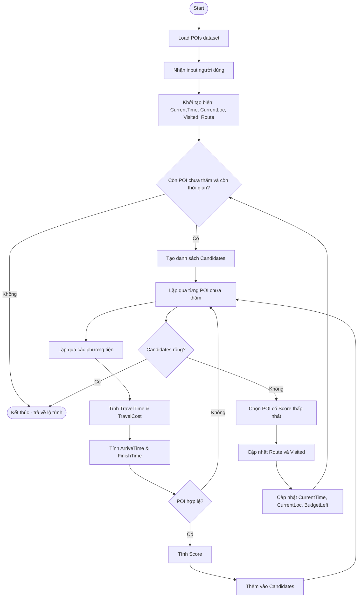

```mermaid
flowchart TD

    A([Start]) --> B[Load POIs dataset]

    B --> C[Nhận input người dùng]

    C --> D[Khởi tạo biến: CurrentTime, CurrentLoc, Visited, Route]

    D --> E{Còn POI chưa thăm và còn thời gian?}

    E -->|Không| Z([Kết thúc - trả về lộ trình])
    E -->|Có| F[Tạo danh sách Candidates]

    F --> G[Lặp qua từng POI chưa thăm]
    G --> H[Lặp qua các phương tiện]

    H --> I[Tính TravelTime & TravelCost]
    I --> J[Tính ArriveTime & FinishTime]

    J --> K{POI hợp lệ?}

    K -->|Không| G
    K -->|Có| L[Tính Score]

    L --> M[Thêm vào Candidates]
    M --> G

    G --> N{Candidates rỗng?}

    N -->|Có| Z
    N -->|Không| O[Chọn POI có Score thấp nhất]

    O --> P[Cập nhật Route và Visited]
    P --> Q[Cập nhật CurrentTime, CurrentLoc, BudgetLeft]

    Q --> E

```