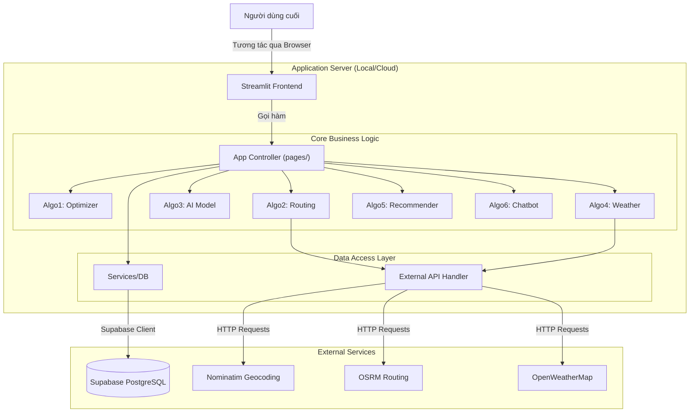
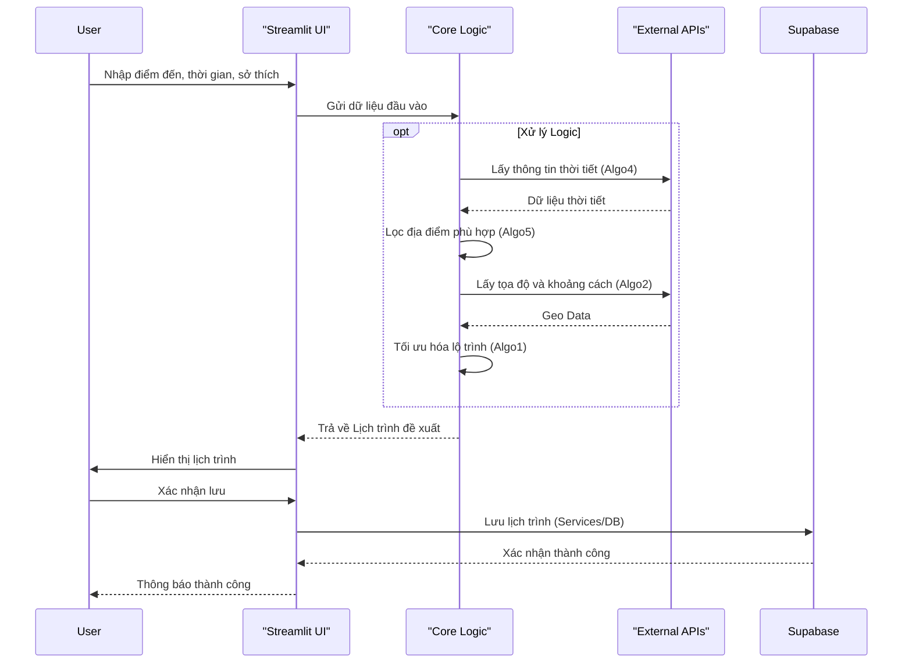
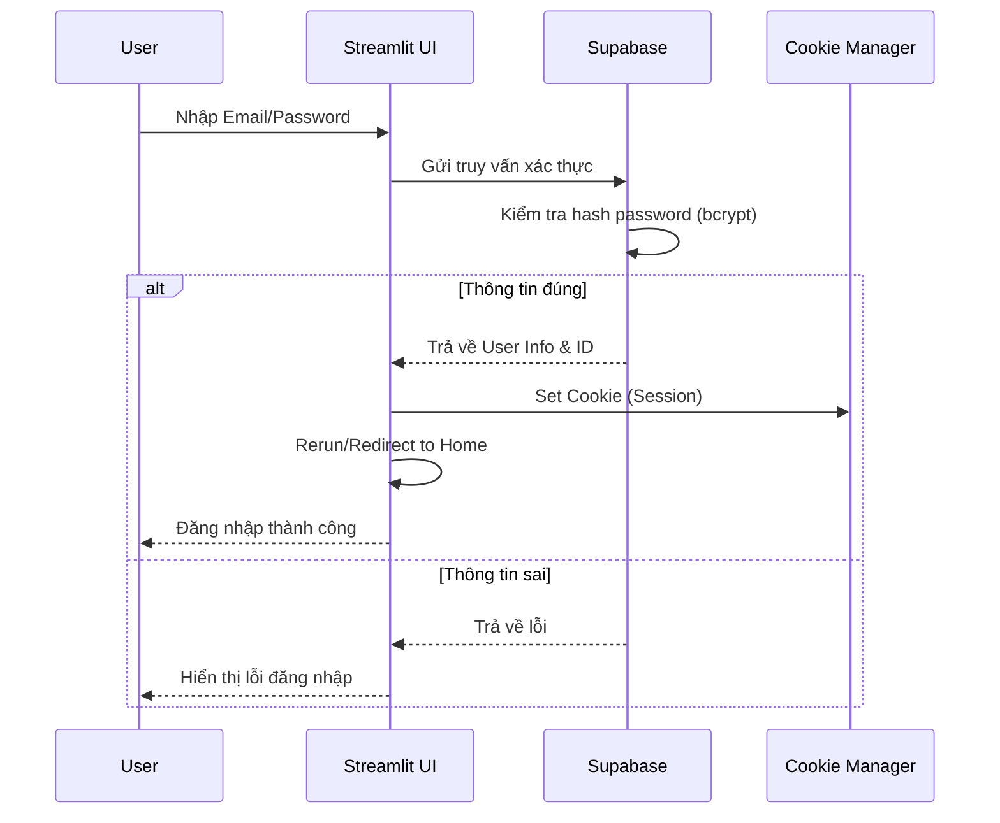
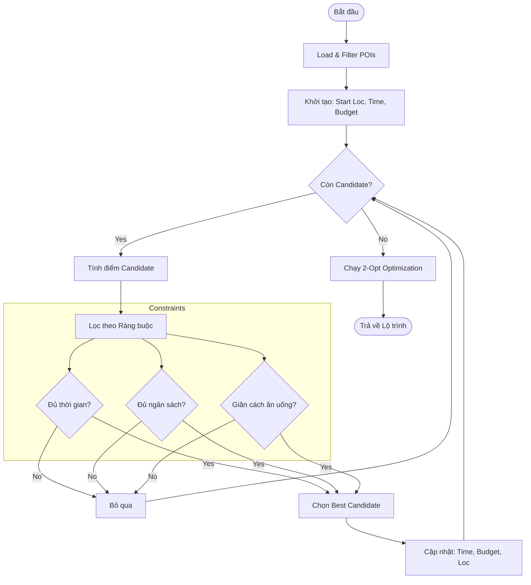
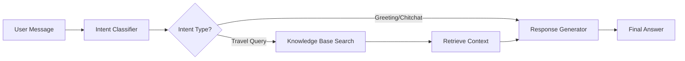
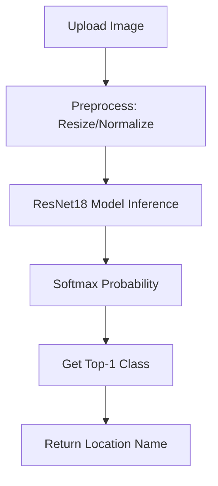

# Sơ đồ Kiến trúc Backend và Quy trình

Dưới đây là các sơ đồ minh họa kiến trúc và luồng dữ liệu của hệ thống WindyAI, sử dụng cú pháp Mermaid.

## 1. Sơ đồ Kiến trúc Tổng quan (System Architecture)



## 2. Luồng xử lý tạo lịch trình (Schedule Creation Flow)



## 3. Luồng xác thực người dùng (Authentication Flow)



## 4. Chi tiết thuật toán tối ưu lộ trình (Algo1 Logic)



## 5. Quy trình Chatbot (Algo6 Design)

Mặc dù hiện tại là phiên bản đơn giản, kiến trúc thiết kế cho Chatbot tuân theo mô hình RAG (Retrieval-Augmented Generation):



## 6. Quy trình Nhận diện ảnh (Algo3 Pipeline)


```
